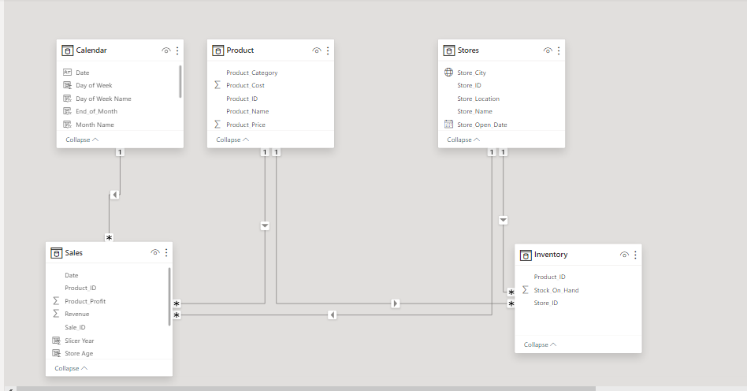
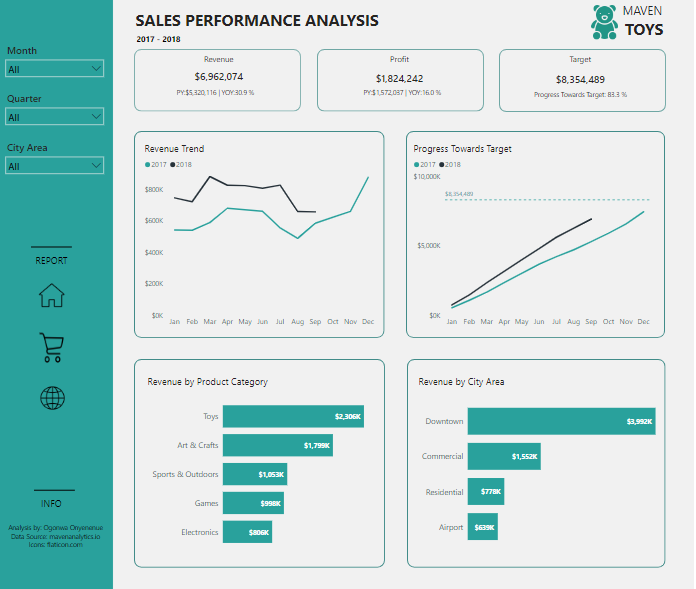
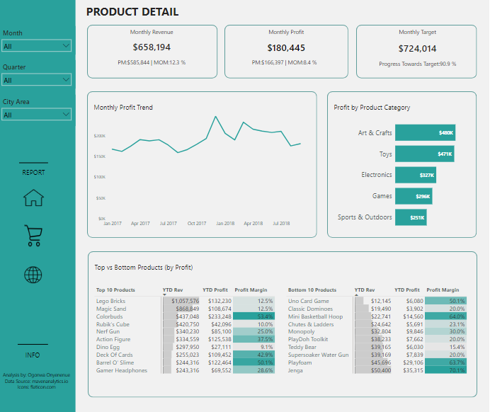
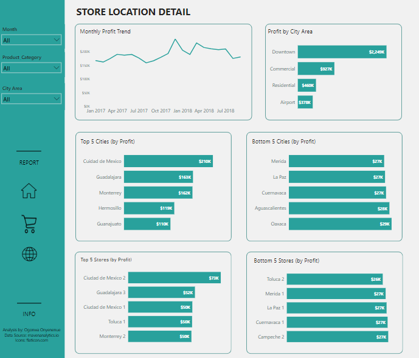

# Sales Performance Analysis Using Power BI

## Introduction

This report presents a sales performance analysis for **Maven Toys**, a fictional chain of toy stores in Mexico, as they aim to expand their business by opening new stores. The objective is to examine intriguing patterns and trends within their dataset, which comprises 4 tables, 829,263 records, and 19 fields.

## Problem statement

1. What is the overall sales trend for Maven Toys?
2. Which products contribute the most to the sales revenue?
3. How has the sales performance varied across different stores? 
4. Are there particular stores that outperform others in terms of sales or profitability?
5. What is the top-selling products in terms of units and revenue?
6. What is the profit margin for each product?
7. How are sales distributed across different cities in Mexico?
8. Does the location of the store impact sales?

## Skills demonstrated

The following Power BI features were incorporated: 
- Data cleaning and manipulation
- DAX
- Page navigators
-	Modelling
-	Filters
-	Tooltips
-	Button

## Data Modelling

The model follows a 5-star schema structure, comprising 3 dimension tables (including a newly created calendar table) and 2 fact tables. All dimension tables are connected to the fact tables through one-to-many relationships.

## Visualization

The report comprises of 3 pages:
1.	Executive Summary
2.	Product detail
3.	Store location detail

You can interact with the dashboard [here](https://app.powerbi.com/view?r=eyJrIjoiMzQ1YjQ4ZGMtNWFhZi00ZmFkLWEyMDgtOGUzNWIyMTY0NjgyIiwidCI6ImNjODUzODE0LWNlNjgtNDRiMS1hZDBhLTdhYzFiZjM1Y2E2ZSJ9)

## Analysis

Assumption made: 
Maven Toys targets a 20% yearly revenue increase and aims for a monthly growth of 10%.

### Executive Summary:

- The revenue trend mirrors the previous year, with progress at 83.3% toward the target.
- Both revenue and profit have seen growth compared to the previous year.

### Product Detail:

- December emerges as the peak season for Maven Toy, with Electronic and Toy categories driving higher profits and revenue during this period.
- Toy and Arts & Crafts categories stand out as Maven Toy's primary revenue and profit drivers with Lego bricks as the leading product.
- The Uno Card Game generates the least revenue among all Maven Toys' products.

### Store Location Detail:

- The Downtown area significantly outperforms other city areas for Maven Toy, generating the highest sales volume.
- Ciudad de Mexico City contributes the most to the generated profits, with its two stores ranking among the top 5 in terms of profit.
- Despite the Airport area contributing the least to the company's profit market, the two top-performing stores are situated in that city area.

## Recommendation

- Given that Downtown locations generate the highest sales volume, strategically prioritize expansion in similar urban centers or areas with high foot traffic to capitalize on this trend.
- Since these categories drive significant revenue and profit for Maven Toys, emphasize product offerings and marketing strategies that promote these categories to maintain and enhance their performance.
- As Ciudad de Mexico city contributes the most to profits and hosts two of the top-performing stores, further investment or strategic initiatives in this region should be done to strengthen market presence and capitalize on existing success.
- The presence of two top-performing stores in the Airport area suggests untapped potential, despite its low overall contribution to profit,. Factors contributing to the disparity should be evaluated to explore the opportunities for improvement.
- Given that December emerges as the peak season for Maven Toys, there should be a robust inventory planning and marketing campaigns, especially for Electronic and Toy categories, to maximize revenue during this period.

## References

1. https://www.indeed.com/career-advice/career-development/how-to-analyze-sales-performance

2. https://www.flaticon.com/free-icon/home_1946488?term=home&page=1&position=4&origin=search&related_id=1946488

3. https://www.flaticon.com/free-icon/shopping-cart_1170678?term=cart&page=1&position=3&origin=search&related_id=1170678

4. https://www.flaticon.com/free-icon/globe_900782?term=globe&page=1&position=3&origin=search&related_id=900782

5. https://www.freepik.com/ai/image-editor?prompt=a+toy+store&style=noStyle

**Thank you for taking this ride with me!🙂**
